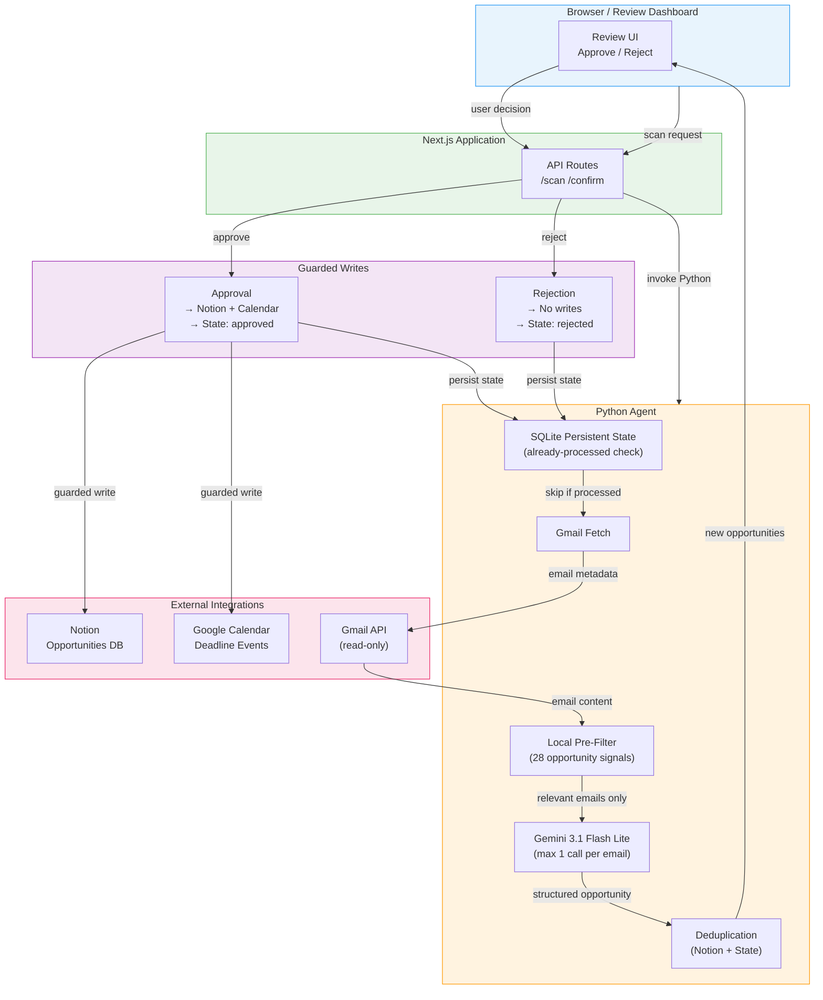

# OppSync AI

**Discover opportunities. Never miss a deadline.**

OppSync AI is a student opportunity discovery agent that scans Gmail for actionable opportunities (internships, hackathons, scholarships, competitions, jobs, workshops, certifications, fellowships), extracts structured information using Gemini, lets the user review them, and sends approved opportunities to Notion and Google Calendar.

## Problem

Students receive dozens of opportunity emails every week — internship announcements, hackathon invitations, scholarship deadlines, competition alerts. Most of these emails get buried or forgotten, and students miss critical deadlines. There is no centralized system to turn these scattered emails into an organized, actionable workflow.

## Solution

OppSync solves this by:

1. **Scanning** your Gmail for opportunity-related emails
2. **Extracting** structured data (name, organization, type, deadline, URL) using Gemini AI
3. **Presenting** opportunities in a clean review interface
4. **Writing** approved opportunities to Notion (database) and Google Calendar (deadline events)

The user retains full control — nothing is written to Notion or Calendar without explicit approval.

## Architecture



- **AI Provider:** Google Gemini (`gemini-3.1-flash-lite`)
- **Execution Layer:** Swytchcode Runtime SDK
- **Web Framework:** Next.js 15 (App Router)
- **Backend:** Python 3.11+
- **State:** SQLite (processed-email tracking for API savings)

## Features

- Gmail opportunity scanning with smart pre-filtering
- Gemini AI extraction with structured output
- Opportunity classification (internship, hackathon, scholarship, etc.)
- Deadline extraction and normalization
- Confidence scoring
- User approval/rejection workflow
- Notion database integration
- Google Calendar event creation
- Deduplication and idempotency
- Prompt-injection defense
- Policy-controlled actions (no Gmail send/delete, no Calendar delete)
- Audit logging

## Tech Stack

| Layer | Technology |
|-------|-----------|
| Frontend | Next.js 15, React 19, TypeScript |
| Backend | Python 3.11+ |
| AI | Google Gemini (gemini-3.1-flash-lite) |
| Integration | Swytchcode Runtime SDK |
| Services | Gmail API, Google Calendar API, Notion API |

## Security

OppSync treats all email content as untrusted input:

- **No automatic writes:** Approval requires explicit user action (click Approve button)
- **Prompt-injection defense:** Gemini system prompt includes rules to ignore instructions found in email content
- **Gmail read-only:** No send/delete capabilities implemented
- **Calendar read+write only:** No delete capabilities
- **Secrets in environment variables:** API keys stored in `.env.local` (gitignored)
- **Duplicate prevention:** Source Email ID used as primary key; fallback dedup on name+org+deadline
- **Audit trail:** All operations logged to JSONL files

## Setup

### Prerequisites

- Node.js v22+
- Python 3.11+
- Swytchcode CLI (`npm install -g swytchcode`)
- Google Gemini API key ([get one here](https://aistudio.google.com/apikey))

### Installation

```bash
# Clone the repository
git clone <repo-url>
cd oppsync-ai

# Install dependencies
npm install
pip install -r requirements.txt

# Set up environment variables
cp .env.example .env.local
# Edit .env.local and add your GEMINI_API_KEY

# Initialize Swytchcode
swy init --editor=none

# Connect integrations
swy get Gmail
swy get "Google Calendar"
swy get notion

# Authenticate
swy auth connect Gmail
swy auth connect "Google Calendar"
swy auth connect notion
```

### Running

```bash
npm run dev
# Open http://localhost:3000
```

## Demo Flow

1. **Open** `http://localhost:3000`
2. **Click** "Scan Recent Emails" — Gemini scans and extracts opportunities
3. **Review** the opportunity cards displayed
4. **Reject** one opportunity — it shows "✕ Rejected", no Notion/Calendar writes
5. **Approve** another — it shows "✓ Approved", creates Notion record + Calendar event
6. **Verify** in Notion — approved opportunity appears in "OppSync Opportunities" database
7. **Verify** in Google Calendar — deadline event created

## Project Structure

```
oppsync-ai/
├── agent/                    # Python AI agent
│   ├── agent.py              # Core orchestration + pre-filter
│   ├── gemini.py             # Gemini API client + injection defense
│   ├── models.py             # Pydantic data models
│   ├── gmail.py              # Gmail integration (read-only)
│   ├── calendar.py           # Google Calendar integration
│   ├── notion.py             # Notion integration
│   ├── writer.py             # Approval workflow orchestrator
│   ├── write_notion.py       # Notion write operations
│   ├── write_calendar.py     # Calendar write operations
│   ├── dedup.py              # Deduplication logic
│   ├── validation.py         # Opportunity validation
│   ├── audit.py              # Audit logging
│   ├── config.py             # Environment configuration
│   └── runtime.py            # Swytchcode Runtime SDK wrapper
├── app/                      # Next.js App Router
│   ├── api/
│   │   ├── scan/route.ts     # Email scan endpoint
│   │   ├── confirm/route.ts  # Approval/rejection endpoint
│   │   └── health/route.ts   # Health check
│   ├── page.tsx              # Main review UI
│   └── layout.tsx            # Root layout
├── scripts/                  # Bridge scripts
├── tests/                    # Unit tests (96 tests)
├── logs/                     # Audit logs
├── .env.example              # Environment template
├── .gitignore                # Git ignore rules
├── package.json              # Node.js dependencies
├── requirements.txt          # Python dependencies
└── README.md                 # This file
```

## Test Suite

```bash
python -m pytest tests/test_opportunities.py -v
```

96 unit tests covering:
- Data models and validation
- Deduplication logic
- Notion/Calendar payload construction
- Gemini extraction and error handling
- Prompt-injection defense
- Writer workflow (approve/reject)
- Double-click protection
- Performance constraints
- Audit logging

## License

Built for Swytchcode Campus Ambassador Task 3.
